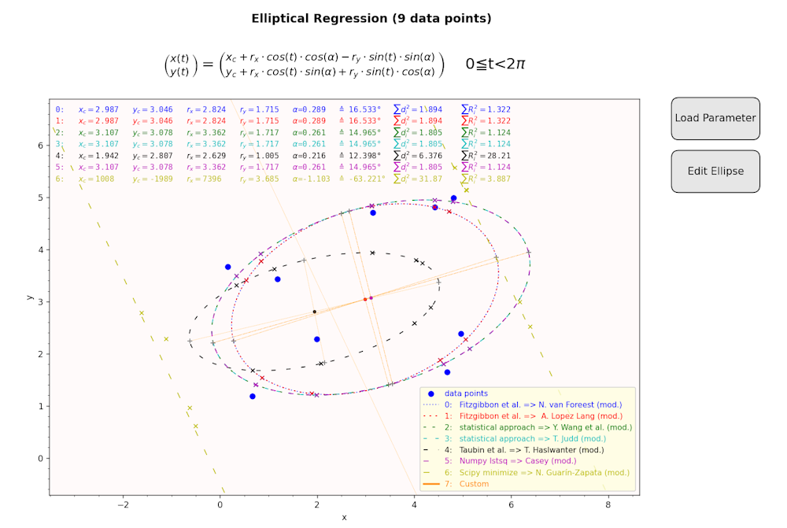

# Fit a 2D ellipse to given data points

This Python program is used for fitting data points to an 2D ellipse.
Several different approaches are used and compared to each other. It is programmed in Python 3.7.9. (windows version).
The parameters of the found regression ellipse can be edited, loaded and saved.

## Files
| File | Description |
|------------------|------------------------------------------|
| *fitEllipse.py* | Main program with the fitting algorithms (Normal start) |
| *start_fitEllipse.py* | Start of program in a venv environment (it will install all requirements in a venv environment) |
| [requirements.txt](requirements.txt "") |	List of requirements (tkintertable is optional but highly recommended) |
| *mainDialog.py* | Main dialog (using tkinter + tkintertable) |
| *editor.py* | Result and editor dialog (using matplotlib) |
| *editorConfig.py* | Editor configuration file (global variables) |
| *fileDialogs.py* | File dialogs (open, save, ...) |
| *quarticFormula.py* | Formulas for quartic equations (including cardanic and quadratic cases) |
| *Icon_fitEllipse.ico* | Icon file for main dialog |
| *fitEllipse.spec* | Spec file for Pyinstaller Packager (windows version) |
| *Docu* (directory)| Documentation files (start ReadMe.html or Readme.md) |
| *Package* (directory)| Packaged version of program (windows EXE only) |
| *Sample_Data* (directory)| Examples for data points and parameter sets (including data points) |

## Start with *fitEllipse.py*
 
The program is started directly with fitEllipse.py (requirements see above).

If *tkintertable* is installed a GUI is shown:

After the regression is started with button 
> Start Regression
 
the results are displayed via matplotlib:

If *tkintertable* is not installed a console is used (lesser options):

After the regression results via matplotlib are closed a summary is shown in the console:

## Start with *Start_fitEllipse.py*
The program is started within a venv enviropnment. The requirements are installed via pip (downloading libraries). This kind of start will take its time...

The advantage of this start type is that no manual installation of Python modules is neccessary. Extra installation is performed automatically in a separate virtual envorinment (venv). Internet Access is needed.

## Start with *fitEllipse.exe* (Package directory)
The program is started as standalone EXE (windows only). No Python is neccessary.
The EXE was packaged with pyinstaller. There is a spec file for Pyinstaller Packager (windows version):

[fitEllipse.spec](fitEllipse.spec "")

## Main dialog
The main dialog:

is divided into 4 areas:

### Selection area
In this area you can:
- select different example point sets (stored for the session),
- load data points from csv- or txt-file (examples below),
- create a new set of data points or
- change number of data points (appending empty points or deleting points).

### Preview area
In this area you will see a preview of the data points if the are validated (see below).

### Data table area
In this are you can edit data points (even scientific format is accepted, commas are translated into points).
In normal cases the input is validated automatically otherways *Validate Data* command can be issued manually.

### Command buttons
In this area you can:
- validate data (check wheter table contains numbers and is complete),
- load data points from csv- or txt-file (examples below),
- save data points to csv-file,
- store current data points as sample (only for this session),
- start regression and show results (&lt;*ENTER*&gt; key)
- cancel (exit programm, &lt;*ESC*&gt; key)

## Result dialog
The result dialog:

is divided into 4 areas:

### Regression results (parameters & errors)
Next to the Regression results (parameters of regression ellipses) also the geometric Error:

$$ \sum_{i=1}^n d_i^2 $$ with $$ d_i $$: distance of data point to ellipse $$

and the residual error:

$$ \sum_{i=1}^n R_i^2 $$ with $$ R = a*x_i^2 + b*x_i*y_i + c*y_i^2 + d*x_i + e*y_i + f $$

are shown. In order to get comparable redidual errors the coefficients are normalized with:

$$ R(x_c, y_c) {\overset{!}{=}} 1 $$

- Regression results (plots and nearest points on ellipse to data points)
- Legend (overview about shown algorithms)
- 